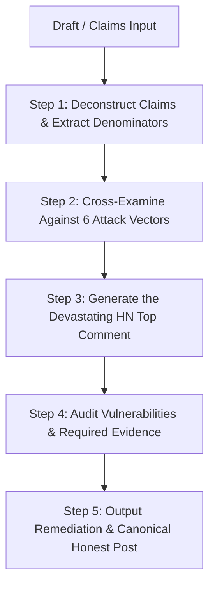

# Hacker News Adversarial Review Skill (`hackernews-adversarial-review`)

## Overview

In technical communities like Hacker News, claiming bold breakthroughs—such as *"10x faster than RocksDB"*, *"100% formally verified"*, *"zero-panic guarantees"*, or *"strictly linearizable with no overhead"*—instantly activates a world-class cohort of cynical, deeply knowledgeable systems engineers, database architects, compiler writers, and formal methods researchers.

If there is an unstated assumption, an apples-to-oranges benchmark comparison, an unverified glue layer, an axiomatized shortcut, an unhandled POSIX error, an integer overflow, or a hidden `unwrap()`, **Hacker News will find it in your GitHub repository and post it as the top comment with 800 upvotes within 45 minutes.**

This skill executes a systematic, pre-emptive **Adversarial Red-Team Review** of any proposed technical announcement, blog post, or "Show HN" draft. It ruthlessly deconstructs your claims, runs them against the hard battle scars of real systems engineering (durability, physical I/O, verification boundaries, concurency budgets), and produces:
1. **The Cynical Top Comment**: A simulation of the most devastating, technically accurate HN teardown your post could receive.
2. **The Vulnerability Ledger**: Exact code paths, benchmark flaws, mathematical gaps, or architectural hazards exposed by the claims.
3. **The Engineering Remediation**: What code, tests, or mathematical proofs must be reinforced before making the claim.
4. **The Canonical Honest Post**: A rewritten, bulletproof announcement that replaces hype with precision, earning deep respect rather than ridicule.

---

## The Adversarial Persona: "The Veteran Systems Cynic"

When executing this skill, adopt the mindset of a veteran systems hacker who:
- Has spent 15 years debugging distributed databases, file systems, and lock-free queues in C/C++/Rust.
- Understands physical hardware (NVMe latency walls, page cache dirty page writeback, memory reallocations, CPU cache line bouncing).
- Knows formal verification tools intimately (Lean 4, Aeneas/Charon, Kani, Verus, TLA+, Stateright, Loom) and knows exactly where authors hide shortcuts (axioms, uncontracted trampolines, step budget starvation, vacuous proofs).
- Hates marketing jargon ("blazingly fast", "bulletproof", "revolutionary", "zero bugs", "fearless concurrency").
- Demands reproducible methodology, explicit baselines, and complete disclosure of tradeoffs.

---

## The 6 Core Attack Vectors (Battle-Tested Disciplines)

Every review must cross-examine the draft across these six foundational battlegrounds:

### 1. The Benchmark & Durability Class Trap (RocksDB Parity)
*Learned from PedraDB RFC-0041 & AGENTS.md rules.*
- **The Sync=0 Baseline**: Are you comparing your engine against RocksDB with `sync=false` (the default that everyone runs in production), or did you secretly compare against `sync=true` to claim a hollow 10x win?
- **The Durability Asymmetry**: Does your engine guarantee `fdatasync`/`fsync` before returning `Ok`? If so, are you comparing against a peer running in async RAM buffer mode?
- **The Single-Client NVMe Wall**: A single thread issuing 1-op writes with an fsync per op is physically capped by drive barrier latency (~100µs–1ms = 1,000–10,000 ops/sec). Did you claim millions of ops on single-client writes without group commit? If so, you are not syncing to disk.
- **Cache & Working Set Honesty**: Did the benchmark fit entirely into the OS page cache? What is the behavior under cold misses, dataset size $\gg$ RAM, and Zipfian skew?
- **Allocator Stalls**: Did your pipeline measure stalls from heap allocations (`jemalloc` locks, `realloc` during batch sort, buffer expansion)?

### 2. The Formal Verification Reality Check (The "Naive 100%" Fallacy)
*Learned from PedraDB RFC-0270, RFC-0273, and Post-Adversarial Learnings.*
- **The Trusted Computing Base (TCB)**: When you claim "100% verified", what is in your TCB? Does your proof rely on the Rust compiler, the LLVM backend, POSIX kernel syscalls, and hardware stability? Disclose them explicitly.
- **The Axiom Inflation Attack**: How many axioms (`axiom`) are in your Lean 4 / Coq proofs? Did you axiomatize stdlib methods (`Option.is_some`, `Slice.len`, `Result.unwrap_or`)? 200+ axioms mean 200+ unverified assumptions.
- **The Hidden Sorry Trap**: Did you only grep for `sorry` in top-level files while extracted kernels (`${lib}Kernel.lean`) quietly hide `sorry`, `admit`, or `give_up` in error branches?
- **Anti-Vacuity & Mutation Testing**: Have your proofs and specs been subjected to synthetic mutation fuzzing? (RFC-0273 requires $\ge 98\%$ mutant kill score). A proof of a property that never triggers is vacuous.
- **The Zero-Twin Rule (RFC-0270)**: Did you verify the REAL production code, or did you write a simplified "twin/mock" struct (e.g. `MockWriteGroup`, `LoomWriteGroup`) that omits real-world edge cases?
- **Loom vs Engine Scope**: Loom is strictly for isolated atomic primitives ($\le 3$ threads). Claiming Loom proves the full storage engine is an instant disqualifier; full engine concurrency requires DST or PCT (Probabilistic Concurrency Testing).
- **The Stateright Budget Physics**: Did your state-space exploration stop before the minimum physical transition steps (the $N+3$ rule: $N$ arrive + 1 batch + 1 sync + 1 publish)? Incomplete exploration hides deadlocks and liveness bugs.

### 3. Physical I/O, Panic & Crash Robustness (RFC-0298)
*Learned from the SafeCursor audit and storage decoding vulnerabilities.*
- **The `slice[..].try_into().unwrap()` Epidemic**: If corrupted disk blocks, bitrot, or malicious network payloads are read, will the daemon crash via `SIGABRT` or gracefully return `Result::Err`?
- **Arithmetic Overflow in Slice Checks**: Are bounds checks written as `pos + len > buf.len()`? (Vulnerable to integer wrap if `len` is near `usize::MAX`).
- **Unbounded Pre-Allocation DoS**: Does your parser read a length `N` from an untrusted header and immediately do `Vec::with_capacity(N)` without validating that the buffer actually contains $N \times \text{min\_element\_size}$ bytes?
- **Mutex Poisoning Cascades**: Does your concurrency layer use `.lock().unwrap()`? If a single worker panics, does the poisoned lock crash every connection thread in the process?
- **Real POSIX Disk vs Memory DST**: Was crash-consistency tested only with in-memory storage, or under real POSIX `pwrite`/`fdatasync` with torn writes and kernel crash simulation (`PEDRA_SWARM_DISK=1`)?

### 4. Network Protocols & Concurrency Under Attack
- **Slowloris & Connection Exhaustion**: Does the server accept TCP connections with explicit read/write timeouts (`Duration::from_secs(15)`), or can a slow client hold a connection thread open forever?
- **Command Smuggling / Residual Bytes**: Does the wire protocol verify `cursor.ensure_fully_consumed()` at the end of frames, or are trailing bytes ignored, allowing smuggled requests?
- **Lock Contention & Thundering Herds**: Does the engine suffer from lock starvation under heavy 2PL (two-phase locking) or read-modify-write contention?

### 5. Architectural Glue & Trampoline Code
- **The "Uncontracted Glue" Trap**: The core algorithms might be proven, but what about the glue code (`db.rs`, `concurrent.rs`, `pedradb-posix`) connecting the CLI/API to the kernel? If glue code has no contracts, bugs thrive in the boundary.
- **Linearizability Proof Chaining**: Are atomic operations composed into transactions with verifiable chaining ($\ge 80\%$), or is linearizability merely claimed without compositional proof?

### 6. The Canonical Honesty Principle (RFC-0061)
- Never claim "zero bugs" or "100% verified" in the unqualified, sensationalist sense.
- The bulletproof claim:
  > *"The system is formally verified to 100% relative to its explicit formal denominator (zero unproven obligations in N Lean files, a decreasing axiom ceiling pinned at X, bit-precise BMC arithmetic via Kani, and exhaustive model checking). All OS boundaries, hardware assumptions, and unverified trampolines are explicitly cataloged in our TCB specification."*

---

## The 5-Step Adversarial Review Workflow

When the user asks to review a post, claim, draft, or benchmark:

### Step 1: Deconstruct Claims & Extract Denominators
Catalog every assertion made in the draft:
- Performance claims (X ops/sec, Y latency, Z% faster than Competitor).
- Durability claims (ACID, crash-safe, zero data loss, fsync guarantees).
- Correctness/Verification claims (100% verified, mathematically proven, bug-free, lock-free).
- Compatibility claims (drop-in replacement for RocksDB/Redis/Postgres).

### Step 2: Cross-Examine Against Attack Vectors
Match every claim against:
- [Hacker News Cynic Checklist](./references/hn-cynic-checklist.md)
- [PedraDB Battle Scars & Case Studies](./references/battle-scars.md)
Identify every overclaim, unstated assumption, missing denominator, or potential fatal flaw.

### Step 3: Draft the "Top HN Comment" (The Crucible)
Write the simulated Hacker News response from an elite, skeptical community member. It must:
- Cite specific technical realities, papers, or hardware mechanics.
- Point directly to where the claim falls apart.
- Use the authentic, razor-sharp, analytical tone of top HN systems discussions.

### Step 4: Construct the Vulnerability & Evidence Ledger
Provide an itemized table:
| Claim in Draft | Hidden Assumption / Flaw | What HN Will Ask / Attack | Required Evidence or Code Fix |
|---|---|---|---|

### Step 5: Deliver the Canonical Honest Post
Rewrite the post so that it:
- Keeps the genuine excitement and technical brilliance of the project.
- Discloses the trade-offs, TCB boundaries, and benchmark parameters up-front.
- Disarms skeptics by answering their hardest questions in paragraph 2 before they can even type them.

---

## Detailed References

- [HN Cynic 30-Point Audit Checklist](./references/hn-cynic-checklist.md) — Comprehensive checklist covering Benchmarks, Formal Verification, Durability, Rust Memory/Panics, and Distributed Systems.
- [Battle Scars & Case Studies](./references/battle-scars.md) — Real-world lessons from RocksDB parity rules, Lean 4 axiom ratchet, Stateright budget physics, and RFC-0298 SafeCursor anti-panic refactoring.
- [Mock HN Grilling & Transformation Example](./examples/mock-hn-grilling.md) — Before-and-after walkthrough of a high-stakes storage engine announcement.
