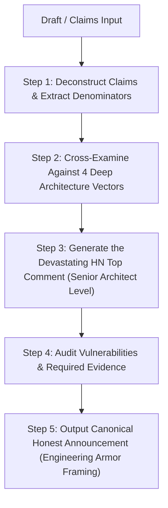

# Hacker News Adversarial Review Skill (`hackernews-adversarial-review`)

## Overview

In technical communities like Hacker News, claiming bold breakthroughs—such as *"10x faster than RocksDB"*, *"100% formally verified"*, *"zero-panic guarantees"*, or *"strictly linearizable with no overhead"*—instantly activates a world-class cohort of cynical, deeply knowledgeable systems engineers, database architects, compiler writers, and formal methods researchers.

If a post attacks naive strawmen, hides benchmark baselines, or claims that an engine has "zero bugs in the entire universe", **Hacker News will dismiss it as amateur hype.** 
Conversely, if an adversarial review merely accuses an author of trivial sync tricks when the author already explicitly baselines against production defaults, **the review itself is weak and misses the real engineering battlegrounds.**

This skill executes a systematic, pre-emptive **Adversarial Red-Team Review** of any proposed technical announcement, blog post, or "Show HN" draft. It evaluates claims against the physical realities of operating systems, storage hardware, concurrency boundaries, and formal methods.

---

## The Core Thesis: "The Engineering Armor for Architectural Boldness"

A world-class systems post does not claim "we proved there are zero bugs in the universe." The Linux VFS, the CPU, and the compiler remain in the TCB.

Instead, the defensible, deeply respected posture is:
> **"Formal Verification of pure mathematical kernels (Lean 4 / Kani) + Real POSIX Deterministic Simulation Testing (`PEDRA_SWARM_DISK=1`) + Continuous Differential Oracles + Safe Rust serve as an ENGINEERING ARMOR. Just like Rust's borrow checker gives developers the courage to write multi-threaded code that would be terrifying to touch in C++, this verification armor is what allows us to be architecturally bold—implementing aggressive off-lock compactions, atomic SuperVersion publishing, lock-free group commit, and zero-copy mmap WAL—with mathematical and mechanical confidence that high complexity does not introduce bugs or regressions."**

When this posture is adopted, the review does not waste time on trivial strawmen. **It attacks precisely where architectural audacity collides with the physics of the operating system and concurrency.**

---

## The 4 Deep Architecture Attack Vectors (Where Audacity Meets Physics)

Every adversarial review must interrogate the draft and codebase across these four deep architectural vectors:

### 1. The Complexity Paradox & Synchronization Glue
- **The Core Paradox:** The pure mathematical kernels (e.g. LSM sequence monotonicity, WAL ledger ring math, key set membership) are formally proven in Lean 4 / Kani. But in a real storage engine, bugs and lost linearizability do not live in the pure algebra of the tree—they lurk in the **synchronization glue** (`concurrent_kernel.rs`, off-lock I/O scheduling, thread-local caching, SuperVersion publishing).
- **The Attack Vector:** 
  - If compaction runs off-lock, what prevents an active reader from seeing a torn or deallocated SST?
  - Does the writer publish the new SuperVersion *atomically* under the exact lock boundary where disk state transitions, or can dropped locks expose intermediate states?
  - Can an uncommitted SST file leak as an orphan file if a worker thread panics during an off-lock flush?
  - Is the synchronization glue covered by continuous differential oracles and DST, or is formal proof of the core falsely conflated with proof of the glue?

### 2. Group Commit Tail Latency Jitter (p99 / p99.9) Under Asymmetric Bursts
- **The Physics of Durability:** A single client issuing 1-op synchronous writes with an `fdatasync` per op is physically throttled by NVMe barrier latency (~80µs–500µs = 2,000–12,000 ops/sec). No engine beats in-memory RAM writes (`sync=false`) on single-client 1-op writes without buffering.
- **The Aggregate vs Tail Dilemma:** Group commit amortizes flash barriers across concurrent clients, delivering massive aggregate throughput (e.g. `apply_mc4` 2.788x). But what happens under **sparse, asymmetric burst workloads**?
  - If you use a coalescing timer window, you introduce artificial latency jitter on p99 / p99.9.
  - If you use a `lone_commit` fast-path bypass for isolated writers, how does the engine transition between lone-commit and sudden concurrency without admission races, lock collapse, or starvation under 32+ cores?

### 3. Mmap WAL & Linux VFS Interactions Under Memory Pressure
- **The Mmap Trade-off:** Using mmap for WAL avoids user/kernel context switches and buffer copies on the hot path. Rust prevents memory safety violations, but **Rust cannot prevent Linux kernel VFS dynamics**:
  - What happens when background compaction generates tens of megabytes of dirty pages while the Linux writeback flusher (`pdflush`/`bdi-writeback`) kicks in? Does the mmap WAL stall, causing write latency spikes of 100ms+?
  - How does the engine handle disk full (`ENOSPC`) on mmap growth? Does it gracefully fail closed with a clean error, or does it trigger an unhandled `SIGBUS` that aborts the process?
  - Are read queries starved at the NVMe device queue when background compaction and WAL writeback issue competing I/O?

### 4. Drop-in RocksDB Parity vs 15 Years of Behavioral Quirks
- **The Drop-in Trap:** Claiming "drop-in compatibility" with RocksDB (`rocksdb-compat`) invites scrutiny over 15 years of accumulated semantics:
  - **Merge Operators:** Does the engine handle partial merge operands with identical associativity and failure semantics?
  - **DeleteRange & Iterators:** How does `DeleteRange` interact with concurrent active snapshots and compaction tombstone collapsing?
  - **Snapshot Visibility:** When a manual or automated compaction drops superseded keys, can a concurrent long-lived snapshot observe resurrected keys or phantom deletes?
  - **Architecture Isolation:** Is `rocksdb-compat` maintained as an isolated compatibility adapter, or did legacy RocksDB quirks pollute and compromise the pure storage kernel?

---

## Durability & Benchmark Rules (Non-Negotiable)

1. **RocksDB Parity Official Peer:** The drop-in comparison is always Pedra vs **RocksDB default**: `WriteOptions.sync=false` (`ROCKS_PARITY_SYNC=0`).
2. **Pedra G1 Default:** Pedra guarantees `fdatasync` before returning `Ok` by default. That is the product: strictly higher durability *and* competitive or superior speed under concurrency.
3. **Apples-to-Apples Comparison:** Benches must compare async vs async or sync vs sync. Single-client write-per-op shapes are physically below 1.0x by construction; group commit closes and inverts the gap under concurrency. Never claim a win against `sync=true` as beating RocksDB default.

---

## The 5-Step Adversarial Review Workflow

### Step 1: Deconstruct Claims & Extract Denominators
Extract performance, durability, formal verification, and compatibility claims. Clarify explicit denominators (number of threads, dataset vs RAM size, sync flags, Lean axioms, TCB boundaries).

### Step 2: Cross-Examine Against Attack Vectors
Match every claim against:
- [HN Cynic 30-Point Audit Checklist](./references/hn-cynic-checklist.md)
- [Battle Scars & Case Studies](./references/battle-scars.md)
Check for: Synchronization Glue races, Tail Latency under asymmetric bursts, Linux VFS/Mmap interactions, and RocksDB-Compat behavioral edge cases.

### Step 3: Draft the "Top HN Comment" (The Crucible)
Simulate the response of a veteran storage architect (TigerBeetle / ScyllaDB / CockroachDB / RocksDB core alumni). Reject cheap strawmen; hit directly at the intersection of architectural boldness and OS physics.

### Step 4: Construct the Vulnerability & Evidence Ledger
| Claim in Draft | Hidden Assumption / Architecture Risk | What HN Will Ask / Attack | Required Evidence or Code Fix |
|---|---|---|---|

### Step 5: Deliver the Canonical Honest Post
Rewrite the announcement adopting the **"Engineering Armor for Architectural Boldness"** thesis. Disclose durability baselines, physical hardware walls, and TCB scope in paragraph 2, disarming critics before they can post.
