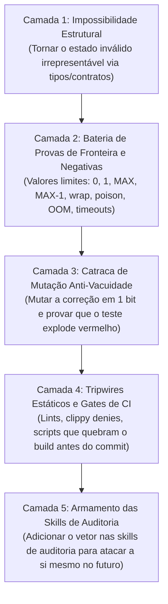

# Incorporate Feedback & Self-Healing Engine (`incorporate-feedback` / `/fix`)

> ### 🛑 A Doutrina Central: "PROIBIDO SER PREGUIÇOSO"
> **O objetivo desta skill não é apenas fazer o teste atual passar. O objetivo é a BLINDAGEM TOTAL:**
> *"Se o crítico mais hostil, cínico e experiente do mundo auditar este repositório amanhã procurando uma brecha neste vetor ou em qualquer primo distante dele, ele não conseguirá nem chegar perto."*
>
> **É expressamente proibido:**
> 1. **Proibido fix pontual ("one-liner superficial")**: Se a auditoria apontou a linha 42, um agente preguiçoso altera a linha 42 e dá como resolvido. O agente desta skill investiga a arquitetura, descobre por que a linha 42 pôde errar, varre todas as ocorrências análogas no projeto e torna o erro estruturalmente impossível.
> 2. **Proibido asserção rasa (shallow asserts)**: Proibido testar apenas o caminho feliz com valores normais ou asserir apenas `assert!(res.is_ok())` sem validar o estado interno, o conteúdo dos bytes e as invariantes de isolamento.
> 3. **Proibido mock complacente**: Proibido inventar mocks simplistas que mascaram as falhas do hardware, do kernel ou da concorrência real.
> 4. **Proibido adiar erradicação ("TODOs")**: A varredura de toda a base de código e a eliminação da classe inteira de bugs é obrigatória e imediata no mesmo turno.
> 5. **Proibido consertar na marra no host**: Proibido intervir manualmente com comandos ad-hoc no terminal para forçar o sistema a funcionar. O sistema deve se auto-reconciliar autonomamente.

---

## Os 5 Pilares da Fortaleza Imunológica (A Crítica Nunca Mais Chega Perto)

Para garantir que uma crítica ou auditoria nunca mais chegue perto do código, toda correção deve erguer as **5 camadas de proteção**:

1. **Camada 1 — Impossibilidade Estrutural (Make Invalid States Unrepresentable)**:
   - Se o bug foi um índice fora de faixa, um ponteiro desalinhado, um lock liberado fora de ordem ou um estado inválido, altere os tipos (ex: `NonZeroU64`, `struct AlignedAddress(u64)`, enum de estados tipados com transições consumidas por valor, `const_assert!`).
   - O código que causou o bug **não deve nem compilar** se for escrito novamente.
2. **Camada 2 — Bateria de Provas de Fronteira e Negativas (Exhaustive Boundary & Adversarial Testing)**:
   - Teste todos os valores limítrofes: $0$, $1$, $\text{MAX}-1$, $\text{MAX}$, overflow, wrapping, strings vazias, buffers truncados, pacotes corrompidos, clocks retrocedendo, disco cheio, OOM forçado.
   - Teste o caminho de falha: verifique que entradas malformadas são rejeitadas de forma honesta, segura e nomeada.
3. **Camada 3 — Catraca de Mutação Anti-Vacuidade (Mutation Ratchet)**:
   - Mute a correção sinteticamente: inverta um `<` para `<=`, delete o `re-arm` do timer, troque um offset em 1 byte, remova um flush de TLB ou barrier.
   - O teste **tem que falhar imediatamente** com 100% de taxa de abate. Se o teste passa com a mutação, o teste é preguiçoso e inútil.
4. **Camada 4 — Tripwires Estáticos e Gates de CI**:
   - Crie uma barreira mecânica que impeça qualquer desenvolvedor ou agente futuro de reintroduzir o padrão:
     - Adicione regras no linter, `#![deny(...)]`, deny de clippy, ou checagens no script de gate/checker do repositório.
5. **Camada 5 — Armamento das Skills de Auditoria (Auditor Weaponization)**:
   - Pegue a crítica exata que revelou o problema e adicione-a como um novo vetor de ataque explícito na checklist de auditoria das skills relevantes (ex: [`hackernews-adversarial-review`](file:///Users/paulo/.gemini/config/skills/hackernews-adversarial-review/SKILL.md), checklists de segurança, etc.).
   - O sistema agora passa a auditar a si mesmo proativamente procurando por essa falha antes que qualquer humano a encontre.

---

## O Ciclo de Execução em 6 Etapas

Quando receber feedback — seja via `/fix`, colado diretamente no chat ou vindo de uma auditoria anterior — execute rigorosamente estas 6 etapas:

### 1. Ingestão, Decodificação e Mapeamento de Contrato
- **Extrair a anatomia exata da falha**:
  - Qual invariante física, arquitetural ou lógica foi violada?
  - Qual o mecanismo causal profundo (não apenas o sintoma)?
  - Qual o raio de alcance (blast radius) no sistema?

### 2. Oráculo Mecânico Prévio (Fase Vermelha Obrigatória)
> [!CAUTION]
> **NÃO TOQUE NO CÓDIGO DE PRODUÇÃO AINDA.** Qualquer alteração antes de provar o bug com um teste que falha é considerada preguiça metodológica.
- Escreva um teste reprodutor determinístico (unitário, integração, DST com seed fixa ou passo de harness).
- Execute o teste e observe a falha com a assinatura exata do bug reportado.

### 3. Correção Arquitetural na Raiz e Prova do Fix (Fase Verde)
- Implemente a correção no nível estrutural correto (arquitetura, máquina de estados, tipos, barriers).
- Rode o teste reprodutor e prove que ele transiciona deterministicamente de `FAIL` para `PASS`.
- Execute a **verificação de mutação**: desative a correção temporariamente e comprove que o teste volta a explodir vermelho.

### 4. Varredura e Erradicação da Classe Inteira em Massa (Mass Sweep)
> [!IMPORTANT]
> **Um bug nunca é filho único.** É a manifestação de um ponto cego sistêmico.
- Abstraia o padrão: *"Onde mais no repositório inteiro esse mesmo padrão, hipótese ingênua ou tipo vulnerável existe?"*
- Execute uma busca exaustiva (`run_command` com `rg`, AST ou análise semântica) em todos os crates, pastas e scripts.
- Corrija **todos** os irmãos encontrados no mesmo turno.
- Escreva testes parametrizados / baseados em propriedades que cubram o domínio completo dessa classe em todos os componentes afetados.

### 5. Auto-Reconciliação e Resiliência Autonômica
- Verifique que o sistema não depende de gambiarras manuais no host para voltar a ficar verde.
- Teste a recuperação autônoma a partir do zero (cold boot) e sob falhas transientes (queda de processo, timeout de rede, perda de disco).
- O reconciliador, supervisor ou loop de controle deve atingir convergência sem qualquer intervenção humana.

### 6. Atualização Imunológica do Sistema (Nunca Mais Regredir em Ignorância)
- **Atualizar skills de auditoria**: adicione o novo vetor de ataque na checklist do [`hackernews-adversarial-review`](file:///Users/paulo/.gemini/config/skills/hackernews-adversarial-review/SKILL.md) e demais ferramentas de revisão.
- **Atualizar os gates do CI**: garanta que a nova suíte de testes e os tripwires estáticos façam parte do gate oficial.
- **Atualizar a memória imutável**: documente o achado, a causa raiz e a nova invariante em `lessons_learned.md`, `ESTADO_VIGENTE.md` ou documentação de arquitetura.

---

## Como Operar o Comando `/fix`

Ao invocar `/fix` (ou `/fix <descrição do problema>`):
1. O comando assume a Doutrina **"Proibido Ser Preguiçoso"**.
2. Ele reporta seu avanço em 6 marcos:
   - `[1/6] Ingestão & Mapeamento de Contrato`
   - `[2/6] Prova Mecânica Prévia (Teste Vermelho)`
   - `[3/6] Correção Estrutural & Catraca de Mutação (Teste Verde)`
   - `[4/6] Varredura e Erradicação da Classe em Massa`
   - `[5/6] Verificação de Auto-Reconciliação (Sem Gambiarras no Host)`
   - `[6/6] Atualização da Fortaleza Imunológica (Skills, CI Gates & Docs)`
3. Entrega o relatório de fechamento com evidências concretas: teste falhando $\rightarrow$ teste passando $\rightarrow$ arquivos varridos e corrigidos $\rightarrow$ invariantes blindadas.
