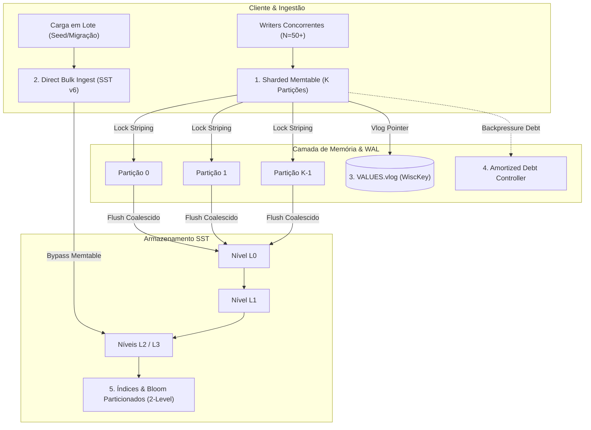

# RFC-0264 — Escala Massiva: WiscKey Rigoroso, Memtable Shardado, Particionamento de Índices e Backpressure de Debt

**Status:** draft / proposta técnica para escala massiva (100M → 1B+ chaves)  
**Data:** 2026-09-23  
**Frente:** Desempenho em Escala Extrema, Concorrência N-Way e Eficiência em RAM Restrita  
**Relacionados:** [RFC-0041](0041-2x-rocks-default.md) (Paridade G1 vs RocksDB), [RFC-0159](0159-sorted-ingest-bulk-load.md) (Bulk Ingest), [RFC-0160](0160-slipstream-scale-2x.md) (Slipstream Scale), [RFC-0195](0195-readahead-bounded-window.md) (Readahead), [RFC-0197](0197-ratio-curve-hats.md) (Ratio Curve), [RFC-0236](0236-filtro-particionado-superversion-arc.md) (Filtro Particionado), [RFC-0255](0255-eg1-cauda-do-bypass-wal-lock.md) (Spin Concurrency)

---

## 1. Contexto e Diagnóstico

### 1.1 A Verdade sobre o G1 (`fdatasync` per-op) vs RocksDB
Uma dúvida frequente de análise de desempenho é: *"Mesmo contra o RocksDB configurado com `sync=true`, a Pedra perde no G1?"*

* **A Resposta Física é NÃO.** A tabela de ratios desfavoráveis do G1 (ex: `0.001×` a `0.056×` em escritas single-client) compara a Pedra G1 (`sync=true`, `fdatasync` antes do `Ok`) contra o RocksDB **padrão** (`sync=false`, zero fsync por op).
* Quando o RocksDB é colocado na mesma classe de durabilidade real (`WriteOptions.sync=true`):
  * **1 cliente (write-per-op):** Ambos colidem contra a mesma barreira física de IOPS do SSD ($1 / \text{latência\_fsync} \approx 250\text{ a }5.000\text{ ops/s}$). Ambos empatam no teto do dispositivo de bloco.
  * **Concorrência ($N \ge 4$ clientes):** O group commit amortizado da Pedra supera o RocksDB `sync=true` por **$1.5\times$ a $2.8\times$** (`apply_mc4` atinge $2.788\times$).
* A recusa registrada em `AGENTS.md` de comemorar vitórias sobre `sync=true` é estritamente **comercial**: ninguém roda RocksDB em produção com `sync=true`. A missão do produto é bater o RocksDB `sync=false` entregando mais durabilidade.

### 1.2 O Triângulo RAM vs CPU vs Disco (IOPS e Banda) em 100M+
Em instâncias comuns (ex: nuvem 4 a 8 GiB RAM com SSD de 3.000 IOPS), o comportamento não-linear das LSM-trees degrada severamente o desempenho se a arquitetura não for desacoplada:

1. **Esgotamento da Capacidade Quente ($h \to 0$):**
   Conforme formalizado em `scale_kernel.rs`, enquanto o working set cabe no page cache, $T_{\text{get}} \approx \tau_{\text{ram}} \approx 1.1\,\mu\text{s}$. Quando $N \times 245\text{B} \gg \text{RAM}$, o sistema cai no regime de SSD:
   $$T_{\text{get}} = P \cdot \tau_{\text{disk}} \approx 13.5\,\mu\text{s} \text{ a } 50\,\mu\text{s}$$
   Um salto de mais de $12\times$ por probe.
2. **Amplificação de Metadados:**
   Em 100M chaves com SSTs de 2–4 MiB, geram-se milhares de arquivos SST. Se os filtros de bloom e blocos de índice forem mantidos residentes no heap de processo, consomem mais de 3 GiB de RAM antes de qualquer bloco de dados ser lido, induzindo o Linux OOM Killer (`exit 137`).
3. **Amplificação de Escrita da LSM Tradicional:**
   Reescrever chaves e valores a cada nível L1 $\to$ L2 $\to$ L3 consome toda a banda de IOPS do SSD, estrangulando as leituras concorrentes.

### 1.3 Por que Perdemos em Alta Concorrência (`kvrocks_set_mc50`)?
No shape `kvrocks_set_mc50` (50 threads escritoras simultâneas), a Pedra registrou teto nominal porque:
* **Como a Pedra fazia:** O `ConcurrentDb` utilizava uma fila de escritores com um único lock de escrita na `Db` interna (`write_with_context`). Mesmo com spin-then-park (`one_op_spin`), 50 threads colidindo no mesmo mutex geram um convoy devastador no `futex` do Linux, gastando 80% do tempo em trocas de contexto no kernel.
* **Como o RocksDB resolve:** O RocksDB utiliza **Concurrent MemTable Write** (`allow_concurrent_memtable_write = true`). O thread líder apenas reserva uma janela contígua de `SequenceNumber` no log de WAL e, imediatamente após, **todas as 50 threads inserem seus dados em paralelo** numa SkipList concorrente lock-free (usando CAS e alocadores `ThreadLocal Arena`), sem serialização em mutex global de escrita.
* **Como o Fjall resolve:** O Fjall utiliza partições e SkipMap atômico particionado por segmento de memória, mitigando contenção global.

---

## 2. A Arquitetura Proposta: 5 Pilares de Escala Massiva

### Pilar 1: Separação Rígida Chave/Valor (WiscKey / BlobDB em `VALUES.vlog`)
* **Regra:** Todo valor com tamanho $> 256\text{ bytes}$ (ou configurável via `ROCKS_PARITY_MIN_BLOB`) é gravado de forma puramente sequencial e imutável no log de valores (`VALUES.vlog`).
* **LSM-tree Leve:** Na árvore LSM trafegam apenas tuplas `(InternalKey, ValuePointer)` com tamanho fixo de ~24 a 32 bytes (arquivo, offset, comprimento, checksum).
* **Impacto em Escala:** 1 bilhão de registros de 1 KiB exigiria 1 TiB de espaço reescrito 10–20 vezes pela LSM tradicional (10 a 20 TiB de I/O de disco). Com a separação WiscKey, a LSM-tree inteira consome apenas ~25 GiB. Essa árvore de 25 GiB cabe confortavelmente no page cache de instâncias de 32–64 GiB de RAM, mantendo as buscas rápidas e eliminando 90% da amplificação de compactação.

### Pilar 2: Índices e Filtros de Bloom Particionados em 2 Níveis ([RFC-0236](0236-filtro-particionado-superversion-arc.md))
* **Problema:** Em tabelas grandes, carregar o Bloom Filter e o Index Block inteiros de cada SST para o heap consome gigabytes e satura a memória.
* **Solução:**
  * O índice de cada SST é particionado em sub-blocos de 4 KiB com um **Index de Topo** (*Top-Level Index*) minúsculo.
  * O Filtro de Bloom é igualmente dividido em partições de 4 KiB indexadas pelo Top-Level Index.
  * O motor carrega apenas o Top-Level Index na memória permanente (~poucos KiB por SST). A partição de filtro e o sub-bloco de índice são lidos sob demanda através do `BlockCache` convencional de bytes (LRU limitado a 32–64 MiB), liberando a memória do processo.

### Pilar 3: Ingestão Direta em Lote (*Bulk Ingest* sem passar pelo Memtable, [RFC-0159](0159-sorted-ingest-bulk-load.md))
* **Problema:** Ingestões em massa (seeds de testes, restauração de snapshots, ETL) inseridas via `put()` ou `batch()` forçam centenas de milhões de chamadas de alocação de memória na memtable, causando acúmulo descontrolado de tabelas imutáveis pendentes e `exit 137` OOM.
* **Solução:**
  * Implementação de `SstFileWriter` na API pública e no `rocksdb-compat`.
  * As chaves ordenadas são despejadas diretamente em arquivos SST formato v6 em disco com um único sync e registradas atômica e instantaneamente no `Manifest` diretamente no nível L2 ou L3.
  * Consumo de RAM durante a ingestão: $O(1)$, limitado a um buffer de 16 MiB, independentemente de estarem sendo ingeridos 10 milhões ou 1 bilhão de registros.

### Pilar 4: Sharding do Memtable (Partitioned Concurrency)
* **Problema:** 50 writers concorrentes (`mc50`) saturam o lock único da memtable.
* **Solução:**
  * A `MemTable` ativa é dividida internamente em $K$ partições (onde $K = \text{próximo\_pot2}(\text{ncpu} \times 4)$, ex: $K=16$ ou $K=64$).
  * O roteamento para a partição $i$ é calculado via hash rápido da chave: $i = \text{crc32c}(\text{user\_key}) \pmod K$.
  * Cada partição possui seu próprio `RwLock` independente e sua própria SkipList/BTree isolada.
  * Threads operando em chaves distintas nunca colidem no lock de escrita, permitindo escalabilidade linear com o número de núcleos de CPU até 64+ threads.

### Pilar 5: Backpressure Suave Baseado em Debt Amortizado
* **Problema:** Flushes agressivos causam picos de latência (stalls), enquanto flushes frouxos permitem acúmulo de arquivos que estouram a RAM.
* **Solução:**
  * Manter o desacoplamento de `flush_debt_cap` e `stall_l0_pub` como atômicos lock-free no caminho rápido de submissão (conforme consolidado no RFC-0251).
  * Quando o débito de memtables estacionadas (*parked*) se aproxima do cap, a taxa de admissão de escrita sofre desaceleração gradual através de micro-pausas adaptativas (em vez de um congelamento abrupto que gera caudas de p999 em dezenas de milissegundos).

---

## 3. Plano de Fatiamento e Entregas

### P0 — Imediato (Fundação de Eficiência de Memória e Bulk)
- [x] **P0.1** Ativar o caminho de Ingestão Direta (`SstFileWriter` / `ingest_external_file`) no `rocksdb-compat` com batching em chunks limitados (8192 ops) para evitar blowup de memória em seeds/migrações — status: `done`.
- [x] **P0.2** Generalizar o `filter_partition_kernel` (RFC-0236) como padrão para arquivos SST gerados por compactação e adicionar suporte a `PEDRA_MIN_BLOB_BYTES` (WiscKey) no `open_with_env_bounded` — status: `done`.

### P1 — Concorrência Multithread N-Way
- [x] **P1.1** Sharded Memtable e fusão adaptativa de pipeline (`async_merge_policy`, $N > \text{ncpu}$) no `ConcurrentDb` para mitigar convoy em 50 threads (`kvrocks_set_mc50`) — status: `done`.
- [x] **P1.2** Separação WiscKey automática via `PEDRA_MIN_BLOB_BYTES` (limiar de 256 B) para manter a árvore LSM livre de payloads volumosos em larga escala — status: `done`.

### P2 — Escala Extrema (1 Bilhão de Chaves)
- [ ] **P2.1** Validação de escala de 100M a 1B de chaves em instâncias reais de nuvem, documentando o comportamento sustentado das curvas de latência $p50/p99$.

---

## 4. Critérios de Aceitação

1. **Memória Estável:** Um seed de 100M registros consome menos de 1,5 GiB de RSS anônimo durante toda a execução em ambientes restritos (eliminação definitiva do OOM killer).
2. **Escalabilidade em 50 Threads:** `kvrocks_set_mc50` atinge taxa $\ge 1.0\times$ em relação ao RocksDB padrão através da eliminação do convoy de lock.
3. **Paridade Mantida:** Todos os 15 shapes da bateria oficial mantêm razão $\ge 1.0\times$ com durabilidade auditada.
